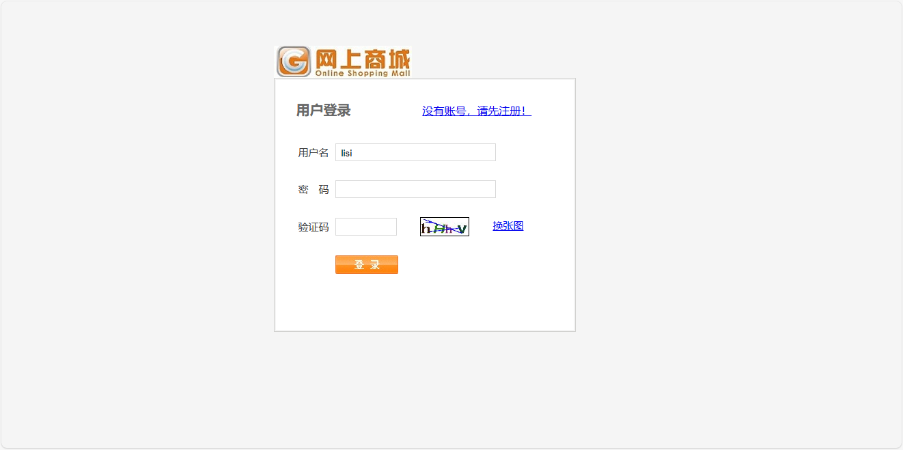
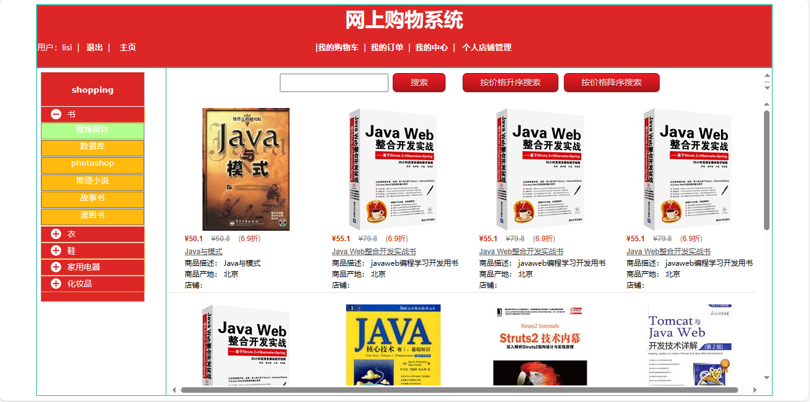
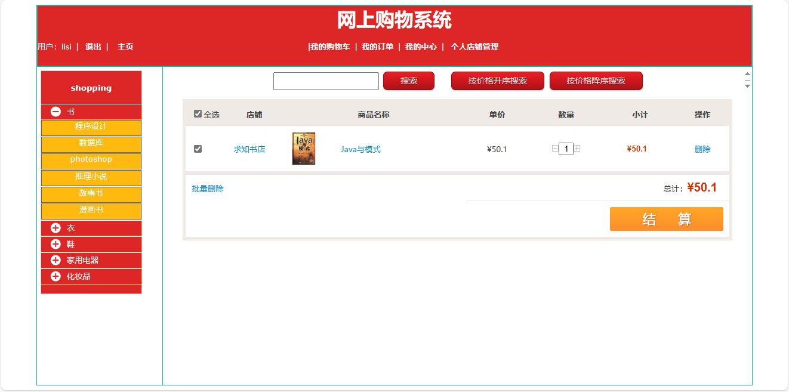
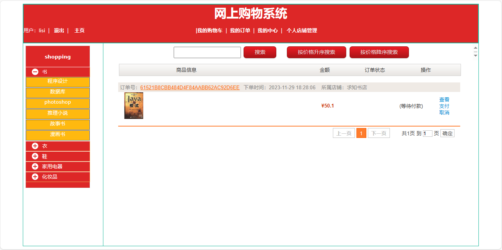
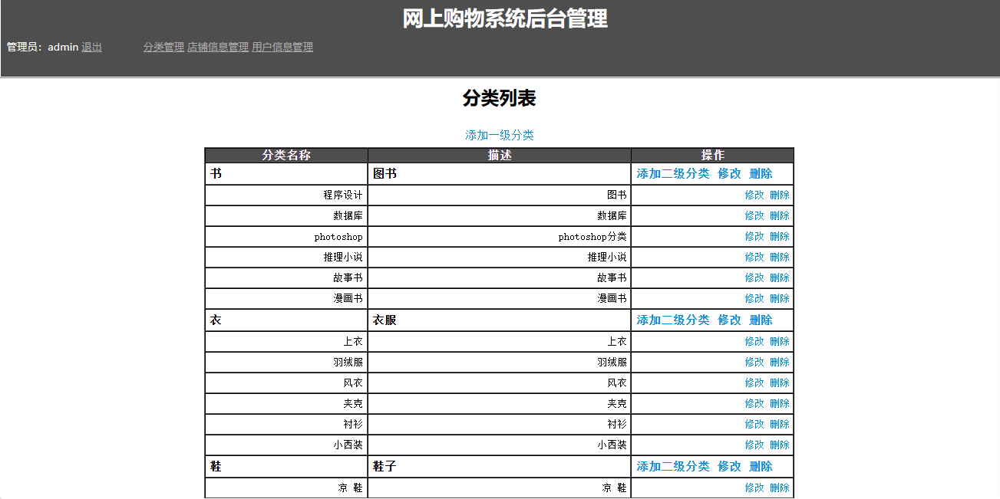
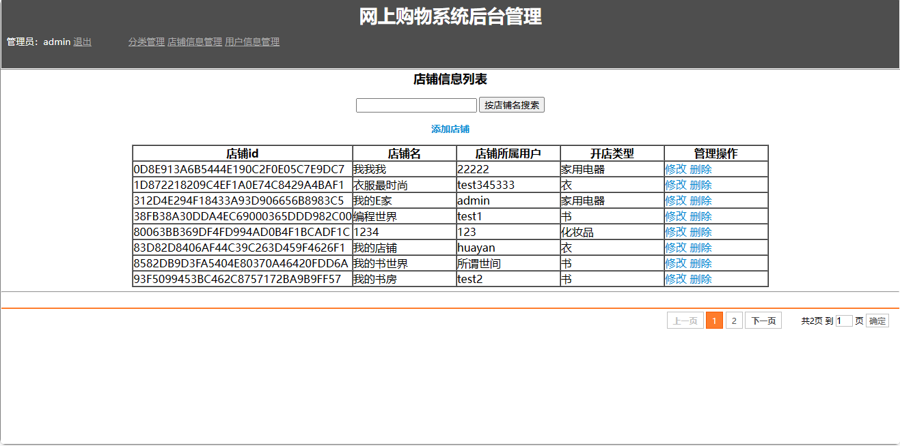
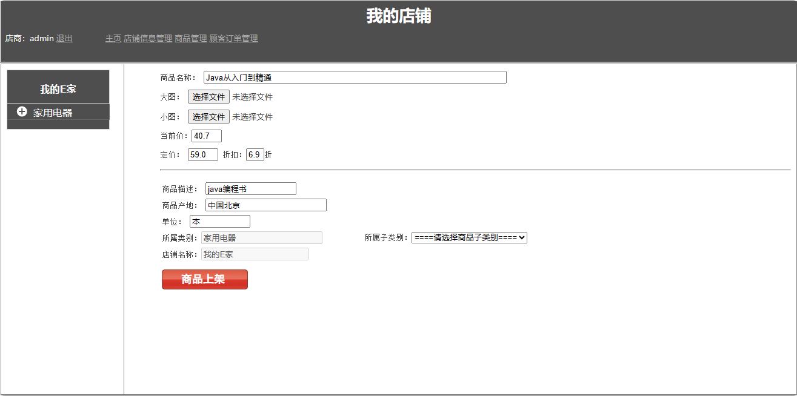

<h1 align="center">38.基于jsp+servlet网上购物管理系统</h1>

 获取sql文件 QQ: 386869957 QQ群: 377586148 

 [推荐站点: 从戎源码网](https://armycodes.com/) 

## 简介

> 本代码来源于网络,仅供学习参考使用!
> 
> 访问地址：http://localhost:8080/shopping/
> 
> 用户登录地址：http://localhost:8080/shopping/jsps/user/login.jsp
> 用户：lisi 123
> 
> 管理员登录地址：http://localhost:8080/shopping/adminjsps/login.jsp
> 管理员：admin 123
> 

## 项目介绍
基于jsp+servlet网上购物管理系统：前端jsp、jquery，后端 servlet，集成用户商品浏览、购物车、在线购买、结算、订单查询、店铺管理等功能于一体的系统。

## 功能介绍

### 用户

- 基本功能：登录、注册、退出、个人中心、密码修改
- 商品销售：分类树形列表、商品列表展示、按价格升降序搜索、商品详情、在线购买、购物车、在线结算
- 个人店铺管理：我的店铺信息查看、商品管理、按商品名搜索、添加商品、商品上架、商品图片上传
- 顾客订单管理：订单列表、未付款、已付款、已发货、交易成功、已取消

### 管理员

- 分类管理：添加一级分类、分类列表、添加二级分类、分类信息修改、分类信息删除
- 店铺信息管理：添加店铺、店铺列表、店铺信息修改、店铺删除
- 用户信息管理：用户列表、按用户名搜索、添加用户、开店、用户信息修改、用户信息删除

## 环境

- <b>IntelliJ IDEA 2009.3</b>

- <b>Mysql 5.7.26</b>

- <b>Tomcat 7.0.73</b>

- <b>JDK 1.8</b>

## 运行截图

